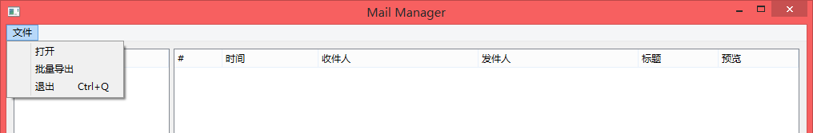
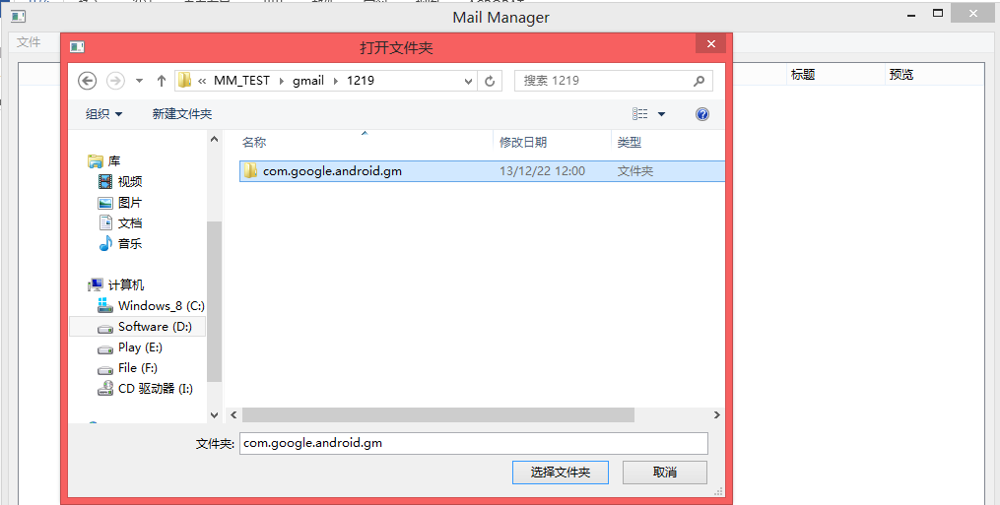
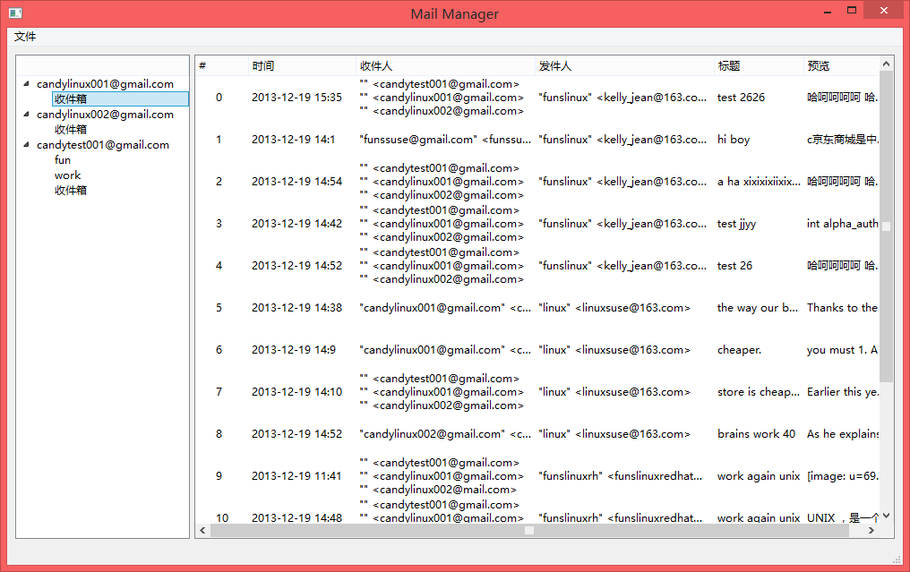
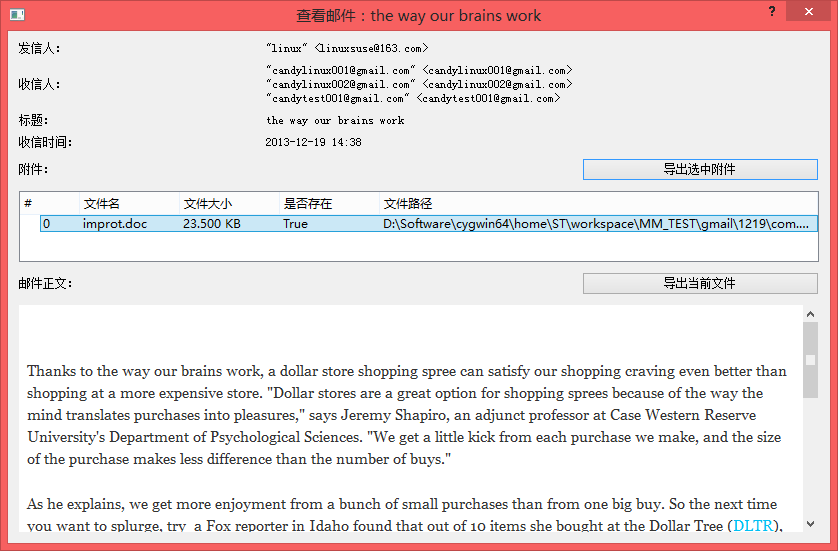

# MailManager

MailManager is a android gmail data viewer in PC. You can use it to view emails and export them to *.eml.

## Dependencies

*   python 2.7
*   SQLalchemy
*   PyQt4

## Usage

1.  Copy `/data/data/com.google.android.gm` to PC.
1.  Click `文件` -> `打开` and choose `com.google.android.gm` folder to open database.

## Screenshot

*   

    ### Open database
    
    

*   
    
    ### View emil
    
    
